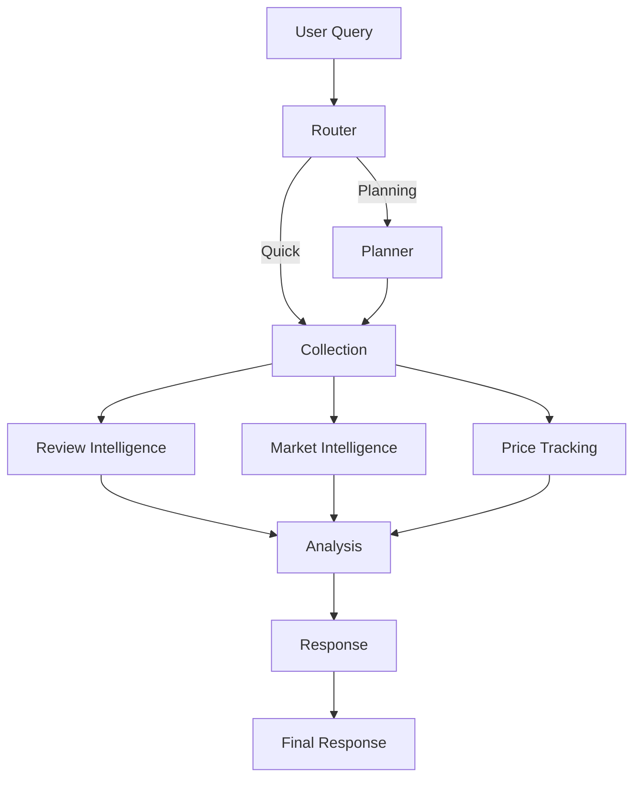

# Amazon Smart Shopping Assistant

> 🚀 **AI-Powered Product Search** - LangGraph + OpenAI GPT-4 + SerpAPI

Multi-agent AI system for intelligent Amazon product recommendations using LangGraph workflow orchestration.

**🎉 Status:** Production Ready | **Version:** 1.2.0

[](https://python.org/)
[](https://fastapi.tiangolo.com/)
[](https://nextjs.org/)
[](LICENSE)

---

## ⚡ Quick Start

```bash
# 1. Clone & setup
git clone git@github.com:xt2201/Ecommerce-Insights-AI.git
cd Ecommerce-Insights-AI
chmod +x setup.sh start.sh run_langgraph.sh

# 2. Configure API keys in .env
# SERPAPI_API_KEY=your_key
# OPENAI_API_KEY=your_key

# 3. Start LangGraph Server (Recommended for Dev)
./run_langgraph.sh
# This starts the LangGraph Studio UI and API server.
# Access Studio UI via the URL provided in the terminal.

# OR Start Standard API Server
python -m uvicorn ai_server.server:app --reload --port 8000

# 4. Start Frontend (Terminal 2)
cd frontend && npm run dev

# 5. Open http://localhost:3000
```

📖 **Detailed Guide:** See [docs/guides/QUICKSTART.md](docs/guides/QUICKSTART.md)

---

## 🏗️ Architecture: 7-Agent System

The system has evolved from a 4-agent to a **7-agent architecture** with parallel execution for maximum efficiency.



### Core Agents:
1.  **Router Agent**: Classifies queries (Direct/Planning/Clarification) and manages conversation flow.
2.  **Planning Agent**: Analyzes intent, extracts requirements, and builds a search strategy.
3.  **Collection Agent**: Fetches raw product data from Amazon via SerpAPI.
4.  **Review Intelligence Agent** (Parallel): Analyzes sentiment, pros/cons, and detects fake reviews.
5.  **Market Intelligence Agent** (Parallel): Identifies market segments, trends, and price gaps.
6.  **Price Tracking Agent** (Parallel): Analyzes price history and deal status.
7.  **Analysis Agent**: Synthesizes all data, calculates Value Scores, and makes trade-off decisions.
8.  **Response Agent**: Generates the final comprehensive markdown report.

👉 **Deep Dive:** Read the full [Technical Agentic Architecture Report](docs/technical_agentic_architecture_report.md).

---

## 🎯 Features

### AI Server (Python + FastAPI + LangGraph)
- ✅ **7 Autonomous Agents**: Specialized roles for deep analysis.
- ✅ **Parallel Execution**: Review, Market, and Price agents run concurrently for speed.
- ✅ **LangGraph Studio**: Visual debugging and interaction with the agent graph.
- ✅ **OpenAI GPT-4**: Powering complex reasoning and decision making.
- ✅ **SerpAPI Integration**: Real-time Amazon product data.
- ✅ **Streaming Responses**: Real-time feedback to the frontend.

### Frontend (Next.js + React)
- ✅ Modern responsive UI with Tailwind CSS.
- ✅ Real-time chat interface with streaming support.
- ✅ Rich markdown rendering for product tables and reports.
- ✅ Interactive product cards.

---

## 📁 Project Structure

```
e-com/
├── ai_server/            # Python Backend & AI Logic
│   ├── agents/          # Agent implementations (Router, Planner, etc.)
│   ├── clients/         # External API clients (SerpAPI, OpenAI)
│   ├── graphs/          # LangGraph workflow definitions
│   ├── memory/          # State management
│   ├── tools/           # Custom tools
│   └── server.py        # FastAPI entry point
│
├── frontend/             # Next.js Frontend
│   ├── src/app/         # App router pages
│   └── src/components/  # React components
│
├── docs/                 # Documentation
│   ├── architecture/    # System design & reports
│   ├── guides/          # Setup & usage guides
│   └── technical_agentic_architecture_report.md # Deep dive report
│
├── run_langgraph.sh      # Script to start LangGraph dev server
├── langgraph.json        # LangGraph configuration
└── README.md            # This file
```

---

## 🛠️ Tech Stack

| Layer | Technology |
|-------|-----------|
| **Orchestration** | **LangGraph** (Stateful Multi-Agent Workflows) |
| **Backend** | Python 3.11, FastAPI |
| **AI Model** | OpenAI GPT-4o / GPT-4-Turbo |
| **Data Source** | SerpAPI (Amazon Product Data) |
| **Frontend** | Next.js 14, React 18, TypeScript, Tailwind CSS |
| **Dev Tools** | LangGraph Studio, Docker |

---

## 📚 Documentation

- **[docs/technical_agentic_architecture_report.md](docs/technical_agentic_architecture_report.md)** - **MUST READ**: Detailed architecture deep dive.
- **[docs/guides/QUICKSTART.md](docs/guides/QUICKSTART.md)** - Setup instructions.
- **[CHANGELOG.md](CHANGELOG.md)** - Version history.

---

## 🚀 Recent Updates

### v1.2.0 - Parallel Intelligence & 7-Agent Architecture
- ⚡ **Performance**: Implemented parallel execution for Intelligence agents (Review, Market, Price), reducing latency by ~40%.
- 🧠 **Smarter Analysis**: Added specialized agents for market context and price tracking.
- 🛠️ **LangGraph Studio**: Full integration for visual debugging.
- 📝 **Consolidated Response**: Optimized response generation for faster Time-To-First-Token.

---

## 🤝 Contributing

1. Fork the repository
2. Create feature branch (`git checkout -b feature/amazing`)
3. Commit changes (`git commit -m 'Add amazing feature'`)
4. Push to branch (`git push origin feature/amazing`)
5. Open Pull Request

---

## 📄 License

MIT License - see [LICENSE](LICENSE) file for details

---

**Built with ❤️ using Python, LangGraph, & OpenAI**

