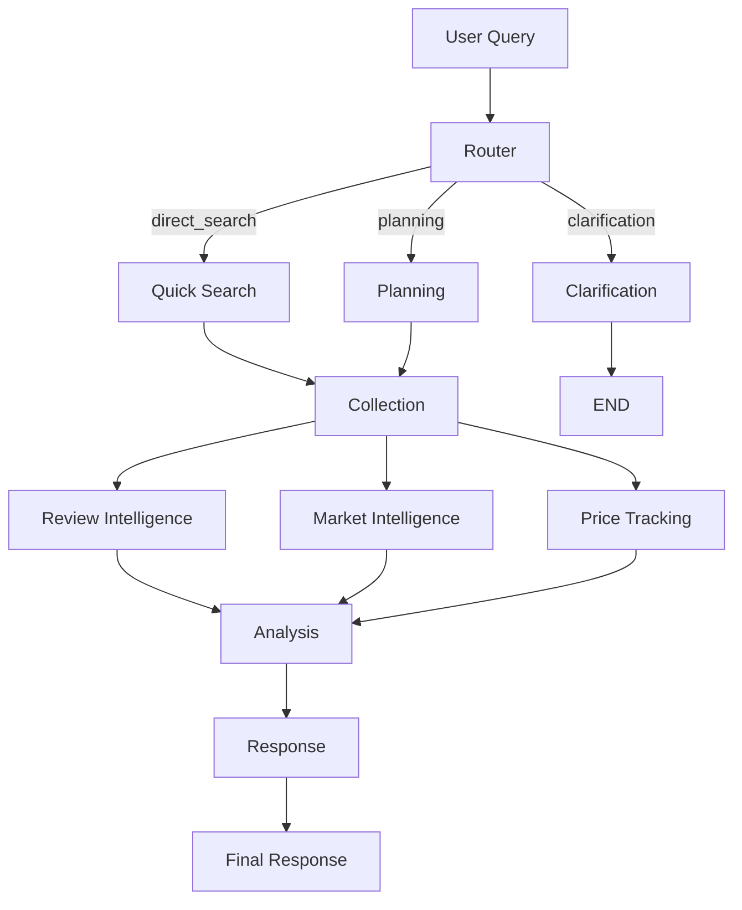

# Amazon Smart Shopping Assistant

> 🚀 **AI-Powered Product Search** - LangGraph + Cerebras AI + SerpAPI

Multi-agent AI system for intelligent Amazon product recommendations using LangGraph workflow orchestration and Cerebras ultra-fast inference.

**🎉 Status:** Production Ready | **Version:** 1.2.0

[](https://python.org/)
[](https://fastapi.tiangolo.com/)
[](https://nextjs.org/)
[](LICENSE)

---

## ⚡ Quick Start

```bash
# 1. Clone & setup
git clone git@github.com:xt2201/Ecommerce-Insights-AI.git
cd Ecommerce-Insights-AI
chmod +x setup.sh start.sh run_langgraph.sh

# 2. Configure API keys in .env
# SERPAPI_API_KEY=your_key
# CEREBRAS_API_KEY=your_key
# LANGSMITH_API_KEY=your_key (optional, for tracing)

# 3. Start LangGraph Server (Recommended for Dev)
./run_langgraph.sh
# This starts the LangGraph Studio UI and API server.
# Access Studio UI via the URL provided in the terminal.

# OR Start Standard API Server
python -m uvicorn ai_server.server:app --reload --port 8000

# 4. Start Frontend (Terminal 2)
cd frontend && npm run dev

# 5. Open http://localhost:3000
```

📖 **Detailed Guide:** See [docs/guides/QUICKSTART.md](docs/guides/QUICKSTART.md)

---

## 🏗️ Architecture: 8-Agent System

The system uses an **8-agent architecture** with parallel execution for maximum efficiency and speed.



### Core Agents:

| # | Agent | Model | Role | Uses LLM | Prompts File |
|---|-------|-------|------|----------|---------------|
| 1 | **Router Agent** | Llama 3.1 8B | Classifies queries → `direct_search` / `planning` / `clarification` | ✅ | `router_agent_prompts.md` |
| 2 | **Planning Agent** | Qwen 3 32B | Analyzes intent, extracts requirements, builds search strategy | ✅ | `planning_agent_prompts.md` (via tools) |
| 3 | **Collection Agent** | - | Fetches raw product data from Amazon via SerpAPI | ❌ | None (API only) |
| 4 | **Review Intelligence** | ZAI GLM 4.6 | Sentiment analysis, pros/cons, fake review detection | ✅ | `review_agent_prompts.md` |
| 5 | **Market Intelligence** | Qwen 3 32B | Market segments, trends, price gaps analysis | ✅ | `market_agent_prompts.md` |
| 6 | **Price Tracking** | Llama 3.3 70B | Price history analysis, deal status | ✅ | `price_agent_prompts.md` |
| 7 | **Analysis Agent** | GPT-OSS 120B | Synthesizes all data, Value Scores, trade-off decisions | ✅ | `analysis_agent_prompts.md` |
| 8 | **Response Agent** | Qwen 3 235B | Generates final comprehensive markdown report | ✅ | `response_agent_prompts.md` |

**Execution:** All agents run on **Cerebras ultra-fast inference** with fallback to Gemini 2.0 Flash and GPT-4o-mini.

**Parallel Execution:** After Collection, Review/Market/Price agents run **in parallel** for maximum speed.

---

## 🎯 Features

### AI Server (Python + FastAPI + LangGraph)
- ✅ **8 Autonomous Agents**: Specialized roles for deep analysis, each optimized with specific Cerebras models.
- ✅ **Parallel Execution**: Review, Market, and Price agents run concurrently for speed.
- ✅ **LangGraph Studio**: Visual debugging and interaction with the agent graph.
- ✅ **Cerebras Ultra-Fast Inference**: Sub-second response times with state-of-the-art open models.
- ✅ **Multi-Provider Fallback**: Automatic fallback to Gemini/OpenAI if Cerebras is unavailable.
- ✅ **SerpAPI Integration**: Real-time Amazon product data.
- ✅ **Streaming Responses**: Real-time feedback to the frontend.
- ✅ **LangSmith Tracing**: Optional monitoring and debugging.

### Frontend (Next.js + React)
- ✅ Modern responsive UI with Tailwind CSS.
- ✅ Real-time chat interface with streaming support.
- ✅ Rich markdown rendering for product tables and reports.
- ✅ Interactive product cards.

---

## 📁 Project Structure

```
e-com/
├── ai_server/            # Python Backend & AI Logic
│   ├── agents/          # 8 Agent implementations
│   │   ├── router_agent.py       # Query classification & routing
│   │   ├── planning_agent.py     # Search strategy planning
│   │   ├── collection_agent.py   # SerpAPI product fetching
│   │   ├── review_agent.py       # Review sentiment analysis
│   │   ├── market_agent.py       # Market trend analysis
│   │   ├── price_agent.py        # Price history analysis
│   │   ├── analysis_agent.py     # Chain-of-thought analysis
│   │   └── response_agent.py     # Final response generation
│   ├── prompts/         # Agent prompt templates (7 .md files)
│   ├── schemas/         # Pydantic models for structured outputs
│   ├── tools/           # Planning tools with LLM calls
│   ├── clients/         # External API clients (SerpAPI)
│   ├── graphs/          # LangGraph workflow (shopping_graph.py)
│   ├── memory/          # Session & preference management
│   ├── llm/             # LLM factory with fallback logic
│   └── server.py        # FastAPI entry point
│
├── frontend/             # Next.js Frontend
│   ├── src/app/         # App router pages
│   └── src/components/  # React components
│
├── config.yaml           # Agent & LLM configuration
├── run_langgraph.sh      # Script to start LangGraph dev server
├── langgraph.json        # LangGraph configuration
└── README.md            # This file
```

---

## 🛠️ Tech Stack

| Layer | Technology |
|-------|-----------|
| **Orchestration** | **LangGraph** (Stateful Multi-Agent Workflows) |
| **Backend** | Python 3.11, FastAPI |
| **AI Models** | **Cerebras** (Llama 3.3, Qwen 3, GPT-OSS 120B) |
| **Fallback Models** | Gemini 2.0 Flash, GPT-4o-mini |
| **Data Source** | SerpAPI (Amazon Product Data) |
| **Frontend** | Next.js 14, React 18, TypeScript, Tailwind CSS |
| **Monitoring** | LangSmith (optional) |
| **Dev Tools** | LangGraph Studio |

---

## 📚 Documentation

- **[config.yaml](config.yaml)** - Agent and LLM configuration (models, temperatures, tokens).
- **[docs/technical_agentic_architecture_report.md](docs/technical_agentic_architecture_report.md)** - **MUST READ**: Detailed architecture deep dive.
- **[docs/guides/QUICKSTART.md](docs/guides/QUICKSTART.md)** - Setup instructions.
- **[CHANGELOG.md](CHANGELOG.md)** - Version history.

---

## 🚀 Recent Updates

### v1.2.0 - Parallel Intelligence & 8-Agent Architecture
- ⚡ **Performance**: Implemented parallel execution for Intelligence agents (Review, Market, Price), reducing latency by ~40%.
- 🧠 **Smarter Analysis**: Added specialized agents for market context and price tracking.
- 🚀 **Cerebras Integration**: Migrated to Cerebras ultra-fast inference with multiple model options.
- 🛠️ **LangGraph Studio**: Full integration for visual debugging.
- 📝 **Consolidated Response**: Optimized response generation for faster Time-To-First-Token.

---

## 🤝 Contributing

1. Fork the repository
2. Create feature branch (`git checkout -b feature/amazing`)
3. Commit changes (`git commit -m 'Add amazing feature'`)
4. Push to branch (`git push origin feature/amazing`)
5. Open Pull Request

---

**Built with ❤️ using Python, LangGraph, & Cerebras AI**
