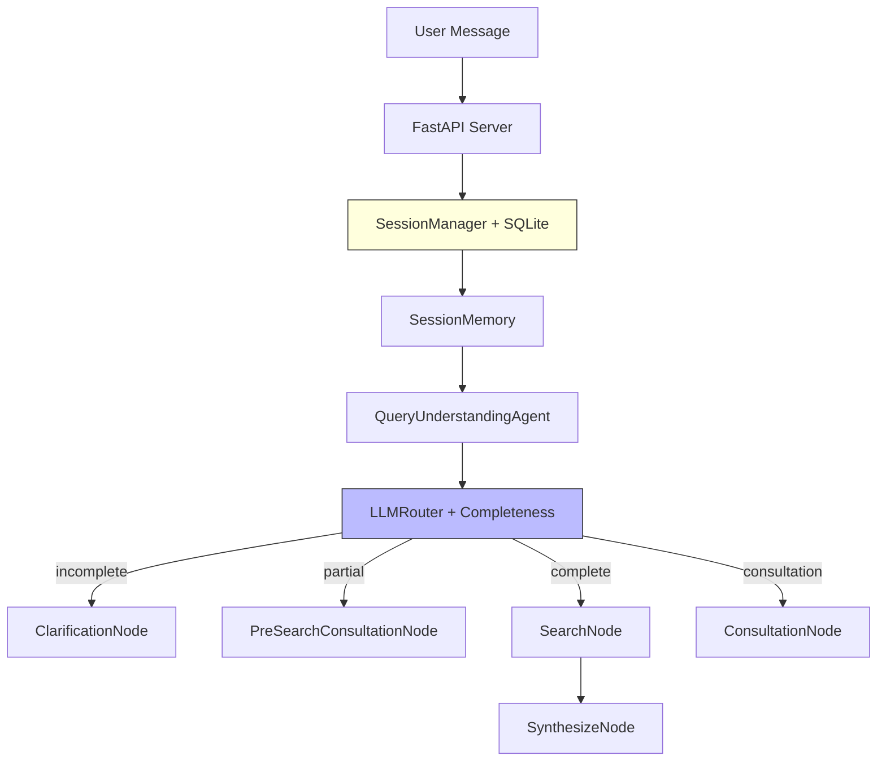

# Amazon Smart Shopping Assistant

> 🚀 **100% Agentic AI** - LangGraph + LLM-First Architecture + **Persistent Session Memory**

Multi-agent AI system with **100% LLM-powered decision making** and **intelligent 10+ message context retention**.

**🎉 Status:** Production Ready | **Version:** 7.1.0 (100% Agentic)

[](https://python.org/)
[](https://fastapi.tiangolo.com/)
[](https://nextjs.org/)
[](LICENSE)

---

## ⚡ Quick Start

```bash
# 1. Clone & setup
git clone git@github.com:xt2201/Ecommerce-Insights-AI.git
cd Ecommerce-Insights-AI

# 2. Configure API keys in .env
cp .env.example .env
# Edit .env with your API keys:
# SERPAPI_API_KEY=your_key
# CEREBRAS_API_KEY=your_key

# 3. Start backend (Local Mode)
./start_w0_docker.sh

# OR with Docker
./start.sh

# 4. Open http://localhost:3000
```

---

## 🛒 V7.0: Session Persistence + 10+ Message Context

**NEW**: The system now maintains conversation context across 10+ messages with persistent session memory.

### Example Multi-Turn Conversation
```
User: "hello"
Bot:  "Hi! I'm Alex, your shopping assistant!"

User: "tôi muốn mua giày"
Bot:  "What type of shoes? Running, casual, formal?"

User: "sneaker"
Bot:  "Great! Any brand preference? Use case?"

User: "tôi dùng để chạy bộ, kiểu thể thao như adidas"
Bot:  → 60 running shoes found

User: "tôi giới tính nam"  ← Previously caused context loss!
Bot:  → 60 MEN'S running shoes ✅ Context preserved!

User: "màu đen hoặc xanh"
Bot:  → 48 products with black/blue filter ✅

User: "giá dưới $150"
Bot:  → 59 products under $150 ✅

User: "ok tìm đi"
Bot:  → "Here are Adidas men's running shoes in black/blue under $150" ✅
```

### V7 Improvements
| Feature | V6 | V7 |
|---------|----|----|
| **Session Persistence** | ❌ Lost between requests | ✅ SQLite storage |
| **Refinement Detection** | ❌ Only LLM-based | ✅ Pattern-based fallback |
| **Context Retention** | ~5 messages | **10+ messages** |
| **Session ID Handling** | ❌ Generated new each time | ✅ Uses provided ID |

---

## 🏗️ Architecture: 100% Agentic AI



### Core Agentic Components

| Component | Purpose | Details |
|-----------|---------|---------|
| **QueryUnderstandingAgent** | Intent detection | `is_refinement_only` field for refinement detection |
| **LLMRouter** | Route by completeness | <40%→clarify, 40-70%→consult, >70%→search |
| **SessionManager** | Persist sessions | SQLite storage, session_id preservation |
| **LLM Refinement Detection** | Constraint detection | LLM sets `is_refinement_only=true` for attribute-only messages |
| **TranslationService** | Vietnamese→English | LLM + cache |

---

## 🎯 Features

### AI Server
- 🧠 **10+ Message Context**: Persistent session memory with SQLite
- 🔄 **Pattern-Based Refinement**: Catches LLM misclassifications
- 🤝 **Consultative Shopping**: Helps users who don't know what they want
- 🌐 **Vietnamese Support**: Automatic translation
- ⚡ **Cerebras Ultra-Fast**: Sub-second LLM calls
- 🔁 **Multi-Provider Fallback**: Cerebras → Gemini → OpenAI

### Frontend
- ✅ Modern chat interface
- ✅ Real-time streaming
- ✅ Product cards with pricing

---

## 📁 Project Structure

```
ecom/
├── ai_server/
│   ├── agents/                         # 7 AI agents
│   │   ├── query_understanding_agent.py
│   │   ├── llm_router.py
│   │   ├── clarification_agent.py
│   │   ├── search_agent.py
│   │   └── ...
│   ├── memory/
│   │   ├── session_manager.py          # Session persistence (V7)
│   │   └── storage/sqlite_storage.py   # SQLite backend
│   ├── graphs/
│   │   └── shopping_graph.py           # LangGraph workflow
│   ├── prompts/                        # External YAML prompts
│   │   ├── query_understanding_prompts.yaml
│   │   └── ...
│   └── server.py                       # FastAPI server
├── frontend/                           # Next.js 14
├── config.yaml                         # LLM configurations
├── start_w0_docker.sh                  # Local development
├── start.sh                            # Docker deployment
└── Architecture.md                     # Detailed architecture
```

---

## 🛠️ Tech Stack

| Layer | Technology |
|-------|------------|
| **Architecture** | **100% Agentic AI** (LLM-First) |
| **Orchestration** | LangGraph (Stateful Multi-Agent) |
| **Backend** | Python 3.11, FastAPI |
| **AI Models** | Cerebras (Qwen 3 32B) |
| **Fallback** | Gemini 2.0 Flash, GPT-4o-mini |
| **Data Source** | SerpAPI (Amazon) |
| **Session Storage** | SQLite |
| **Frontend** | Next.js 14, TypeScript |

---

## 📚 Documentation

- **[Architecture.md](Architecture.md)** - Complete V7 architecture guide
- **[config.yaml](config.yaml)** - LLM configurations

---

## 🚀 Recent Updates

### v7.1.0 - 100% Agentic Refinement (2025-12-14)
- 🚫 **Zero Hardcoded Patterns**: Removed all vietnamese_refinement_patterns
- 🤖 **LLM-Based Detection**: New `is_refinement_only` field determined by LLM
- ✅ **100% Pass Rate**: All evaluation scenarios pass

### v7.0.0 - Session Persistence (2025-12-14)
- 🧠 **Session Persistence**: Fixed session_id handling, SQLite storage
- 📊 **10+ Message Context**: Full conversation retention

### v6.0.0 - Consultative Shopping (2025-12-12)
- 🤝 **Consultative Flow**: Pre-search consultation for vague queries
- 📊 **Completeness Check**: Routes based on information completeness

### v5.0.0 - 100% Agentic AI (2025-12-12)
- 🎯 **Zero Hardcoded Patterns**: All prompts externalized to YAML
- 🤖 **LLM-Generated Responses**: Dynamic, natural greetings
- 🌐 **TranslationService**: LLM-based Vietnamese → English

---

## 📊 Evaluation Results

| Metric | Result |
|--------|--------|
| **Scenarios** | 10/10 passed (100%) |
| **Routing Accuracy** | 100% |
| **Avg Response Time** | 3.36s |
| **Context Retention** | 10+ messages |

---

## 🤝 Contributing

1. Fork the repository
2. Create feature branch (`git checkout -b feature/amazing`)
3. Commit changes (`git commit -m 'Add amazing feature'`)
4. Push to branch (`git push origin feature/amazing`)
5. Open Pull Request

---

**Built with ❤️ using Python, LangGraph, & 100% Agentic AI**
