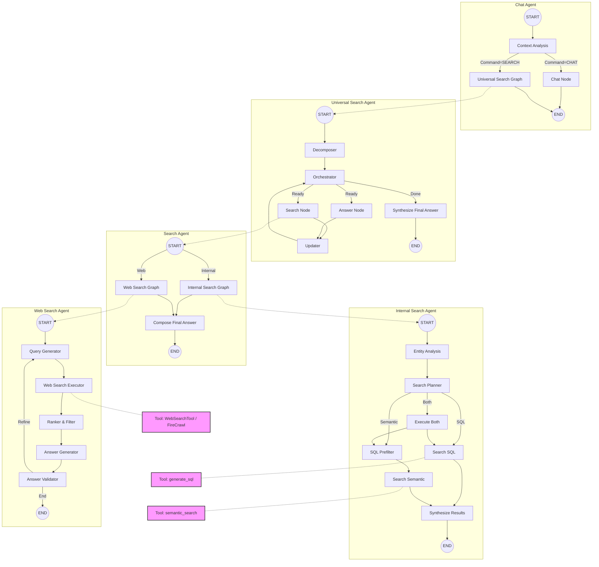

# Chat Graph Architecture Analysis

This document details the architecture of the [Chat](file:///home/thanhnx/ai_core_server/agents/chat/state/__init__.py#5-14) agent and its sub-graphs, based on the code in the `agents` directory.

## Overview

The architecture is a hierarchical composition of LangGraph graphs. The main entry point is the **Chat Graph**, which routes to specific capabilities like **Universal Search**. Universal Search further delegates to **Search Graph**, which orchestrates **Internal Search** and **Web Search**.

### Hierarchy
- **Chat Graph** (`agents/chat/graph`)
  - **Universal Search Graph** (`agents/universal_search/graph`)
    - **Search Graph** (`agents/search/graph`)
      - **Internal Search Graph** (`agents/internal_search/graph`)
      - **Web Search Graph** (`agents/web_search/graph`)

---

## Architecture Diagram

---

## 1. Chat Graph
**Location**: `agents/chat/graph/__init__.py`
**State**: `ChatState`
**Tools**: None (Pure LLM orchestration)

**Nodes**:
- `context_analysis`: Analyzes user input to determine `relevant_query` and `command`.
- `chat`: Handles general conversation.
- `universal_search_graph`: Sub-graph for "SEARCH" command.

---

## 2. Universal Search Graph
**Location**: `agents/universal_search/graph/__init__.py`
**State**: `UniversalSearchState`
**Tools**: None (Orchestration & LLM)

**Nodes**:
- `decomposer`: Breaks down query into `SubQuery` list.
- `orchestrator`: Manages subquery execution flow.
- `search`: Executes "search" intent subqueries via `Search Graph`.
- `answer`: Executes "answer" intent subqueries using LLM.
- `updater`: Updates state with results.
- `synthesize_final_answer`: Aggregates results.

---

## 3. Search Graph
**Location**: `agents/search/graph/__init__.py`
**State**: `SearchState`
**Tools**: None (Router)

**Nodes**:
- `internal_search_graph`: Routes to Internal Search.
- `web_search_graph`: Routes to Web Search.
- `compose_final_answer`: Formats final result.

---

## 4. Internal Search Graph
**Location**: `agents/internal_search/graph/__init__.py`
**State**: `InternalSearchState`

**Nodes & Tools**:
- `entity_analysis`: Extracts entities.
- `search_planner`: Decides strategy (`sql`, `semantic`, `both`).
- `sql_prefilter`:
  - **Tool**: `generate_sql` (via LLM structured output).
  - **Function**: Generates SQL WHERE clauses to filter semantic search.
- `search_sql`:
  - **Tool**: `generate_sql` (from `tools.sql.tools`).
  - **Function**: Generates and executes SQL queries against the database.
- `search_semantic`:
  - **Tool**: `semantic_search` (from `tools.vts.tools`).
  - **Function**: Performs vector search on the knowledge base.
- `synthesize_search_results`: Combines SQL and Semantic results.

---

## 5. Web Search Graph
**Location**: `agents/web_search/graph/__init__.py`
**State**: `WebSearchState`

**Nodes & Tools**:
- `query_generator`: Generates optimized search queries.
- `web_search`:
  - **Tool**: `WebSearchTool` (wraps FireCrawl service).
  - **Function**: Performs web search and scrapes content.
- `ranker_filter`: Ranks results by relevance and recency; filters duplicates.
- `answer_generator`: Synthesizes answer from web results.
- `answer_validator`: Checks answer quality; triggers refinement if needed.
