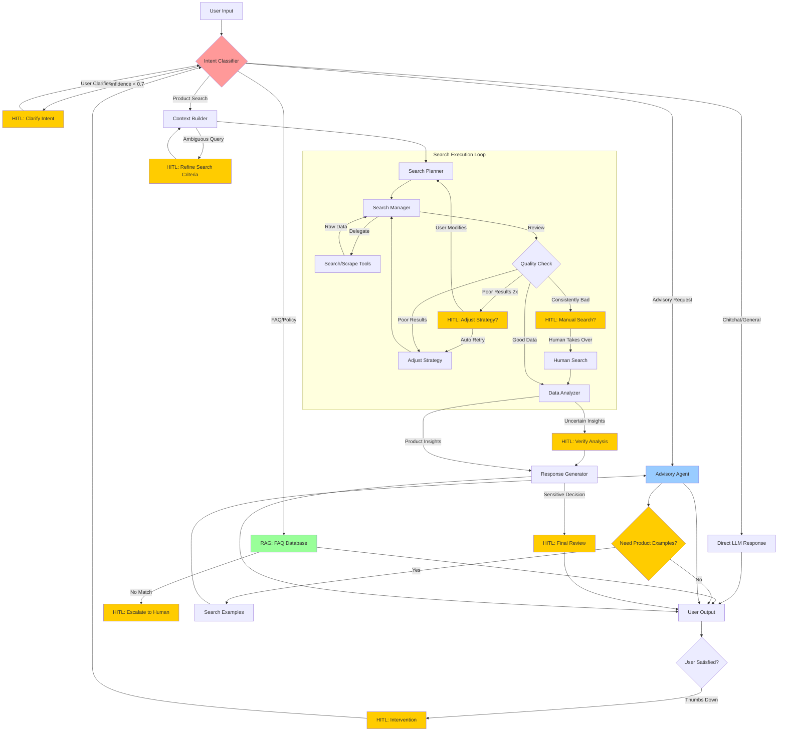

```mermaid
graph TD
    UserInput[User Input] --> IntentClassifier{Intent Classifier}
    
    %% HITL cho intent không rõ
    IntentClassifier -->|Low Confidence < 0.7| HITL1[HITL: Clarify Intent]
    HITL1 -->|User Clarifies| IntentClassifier
    
    %% Chitchat path
    IntentClassifier -->|Chitchat/General| ConversationalLLM[Direct LLM Response]
    ConversationalLLM --> UserOutput[User Output]
    
    %% FAQ path
    IntentClassifier -->|FAQ/Policy| RAGSystem[RAG: FAQ Database]
    RAGSystem -->|No Match| HITL2[HITL: Escalate to Human]
    RAGSystem --> UserOutput
    
    %% Advisory path
    IntentClassifier -->|Advisory Request| AdvisoryAgent[Advisory Agent]
    AdvisoryAgent --> HITL3{Need Product Examples?}
    HITL3 -->|Yes| ProductSearch[Search Examples]
    HITL3 -->|No| UserOutput
    ProductSearch --> AdvisoryAgent
    AdvisoryAgent --> UserOutput
    
    %% Product search path với HITL checkpoints
    IntentClassifier -->|Product Search| ContextBuilder[Context Builder]
    ContextBuilder -->|Ambiguous Query| HITL4[HITL: Refine Search Criteria]
    HITL4 --> ContextBuilder
    
    ContextBuilder --> Planner[Search Planner]
    Planner --> Manager[Search Manager]
    
    subgraph "Search Execution Loop"
        Manager -->|Delegate| Tools[Search/Scrape Tools]
        Tools -->|Raw Data| Manager
        Manager -->|Review| Reflector{Quality Check}
        
        %% HITL trong execution loop
        Reflector -->|Poor Results 2x| HITL5[HITL: Adjust Strategy?]
        HITL5 -->|User Modifies| Planner
        HITL5 -->|Auto Retry| RePlanner[Adjust Strategy]
        
        Reflector -->|Consistently Bad| HITL6[HITL: Manual Search?]
        HITL6 -->|Human Takes Over| ManualSearch[Human Search]
        ManualSearch --> Analyzer
        
        Reflector -->|Poor Results| RePlanner
        RePlanner --> Manager
        Reflector -->|Good Data| Analyzer[Data Analyzer]
    end
    
    Analyzer -->|Uncertain Insights| HITL7[HITL: Verify Analysis]
    HITL7 --> Response
    
    Analyzer -->|Product Insights| Response[Response Generator]
    Response -->|Sensitive Decision| HITL8[HITL: Final Review]
    HITL8 --> UserOutput
    Response --> UserOutput
    
    %% Feedback loop
    UserOutput --> FeedbackCollector{User Satisfied?}
    FeedbackCollector -->|Thumbs Down| HITL9[HITL: Intervention]
    HITL9 --> IntentClassifier
    
    style IntentClassifier fill:#ff9999
    style AdvisoryAgent fill:#99ccff
    style RAGSystem fill:#99ff99
    style HITL1 fill:#ffcc00
    style HITL2 fill:#ffcc00
    style HITL3 fill:#ffcc00
    style HITL4 fill:#ffcc00
    style HITL5 fill:#ffcc00
    style HITL6 fill:#ffcc00
    style HITL7 fill:#ffcc00
    style HITL8 fill:#ffcc00
    style HITL9 fill:#ffcc00
```