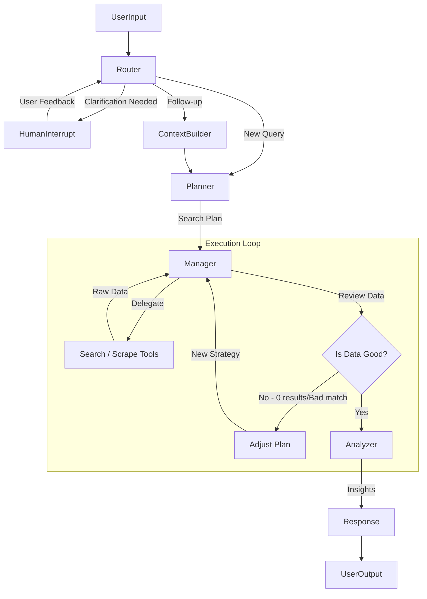

# Architecture Improvement Proposal: Transitioning to a True Agentic System

## 1. Executive Summary

The current architecture is a **Linear Workflow (DAG)** that excels at structured execution but lacks the "agentic" traits of adaptability, self-correction, and long-term learning. This proposal outlines a transition to a **Cyclic Multi-Agent System** incorporating **Reflection**, **Hierarchical Planning**, and **Persistent Memory**.

**Key Goals:**
1.  **Adaptability:** Enable the system to self-correct when search results are poor (Reflection Loop).
2.  **Continuity:** Maintain context and "interrupt" for user clarification without losing state (HITL).
3.  **Efficiency:** Query a local "Product Knowledge Graph" before searching the web (Memory).
4.  **Personalization:** Actively use user preferences to shape search plans, not just rank results.

---

## 2. Proposed Architecture: The "Reflective Hierarchical" Pattern

We propose moving from a fixed pipeline (`Router -> Plan -> Collect -> Analyze`) to a **State Machine with Feedback Loops**.

### 2.1. High-Level Graph (Cyclic)

### 2.2. Core Components

#### A. The "Manager" Agent (Orchestrator)
*   **Role:** Acts as the "Supervisor" in the Manager-Worker pattern.
*   **Responsibility:**
    *   Receives the high-level plan.
    *   Delegates tasks to specific tools (SerpAPI, Scraper).
    *   **CRITICAL:** Evaluates the *quality* of tool output immediately. If `products_found == 0`, it triggers a retry with broader keywords *without* asking the user.

#### B. The "Reflector" (Critic)
*   **Role:** Implements the **Reflection Pattern**.
*   **Responsibility:**
    *   Checks if the collected products actually meet the user's "Must-have" requirements.
    *   If the user asked for "Sony headphones under $50" and we found only "$100" ones, the Reflector flags this discrepancy and requests a new search strategy (e.g., "Search for refurbished models").

#### C. Human-in-the-Loop (HITL) with Interrupts
*   **Mechanism:** Use LangGraph's `interrupt` (or `NodeInterrupt`).
*   **Flow:**
    1.  Router detects ambiguity (e.g., "cheap headphones").
    2.  System pauses execution and yields a question to the user ("Define 'cheap'?").
    3.  User replies.
    4.  System **resumes** with the answer injected into the state, continuing to Planning.
    *   *Improvement:* No longer "ends" the session; the thread remains active.

---

## 3. Memory & Data Strategy

### 3.1. Product Knowledge Store (The "Brain")
Instead of discarding search results, we will build a **Product Database** (SQLite + Vector Search).

*   **Schema:** `Product(id, title, price, specs_json, embedding)`
*   **Workflow:**
    1.  **Before Search:** Agent queries Product DB: "Do we already know about 'Sony WH-1000XM5'?"
    2.  **After Search:** New findings are upserted into Product DB.
    3.  **Benefit:** "Compare X and Y" queries become instant DB lookups if data exists.

### 3.2. Active User Profile (Long-term Memory)
*   **Current:** Preferences used only for *scoring* at the end.
*   **Proposed:** Preferences used for *planning* at the start.
*   **Mechanism:**
    *   `ContextBuilder` retrieves `UserPreferences`.
    *   Injects into Planner Prompt: "User prefers Sony. Ensure 'Sony' is in the keyword list."

---

## 4. Implementation Roadmap

### Phase 1: The Loop (Reflector)
*   [ ] Modify `Collection Agent` to return a status (Success/Partial/Fail).
*   [ ] Add a conditional edge in LangGraph: If `Fail` -> Go back to `Planning` (with "Broaden Search" instruction).

### Phase 2: The Memory (Product Store)
*   [ ] Setup SQLite/ChromaDB.
*   [ ] Create `ProductRetriever` tool.
*   [ ] Update `Planning Agent` to check DB before web search.

### Phase 3: The Interrupt (HITL)
*   [ ] Refactor `Clarification` node to use `interrupt`.
*   [ ] Update Frontend to handle "Resumable" threads.

---

## 5. Comparison

| Feature | Current Architecture | Proposed Architecture |
| :--- | :--- | :--- |
| **Flow** | Linear (A -> B -> C) | Cyclic (A -> B <-> C -> D) |
| **Error Handling** | Fail or Return Empty | Self-Correct & Retry |
| **Ambiguity** | Ask & Quit | Ask, Wait, & Resume |
| **Data** | Ephemeral (Lost after chat) | Persistent (Builds Knowledge Base) |
| **Intelligence** | Reactive | Proactive (Reflective) |
